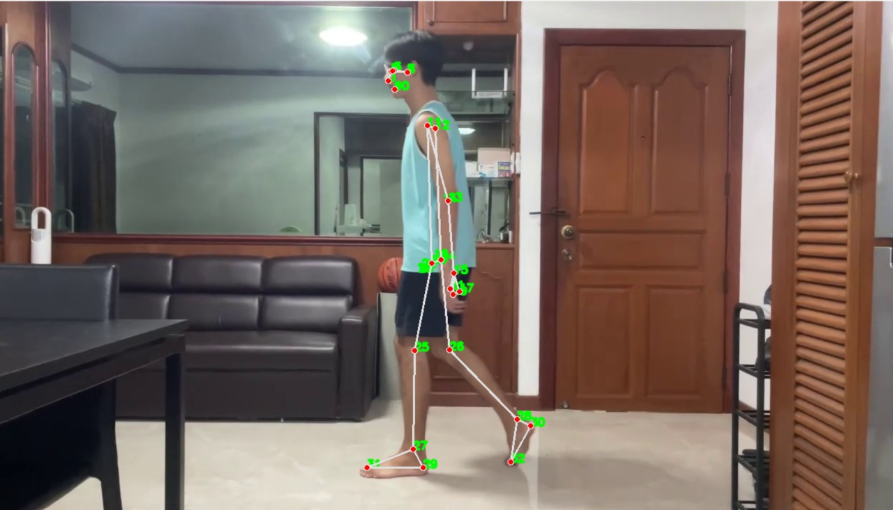
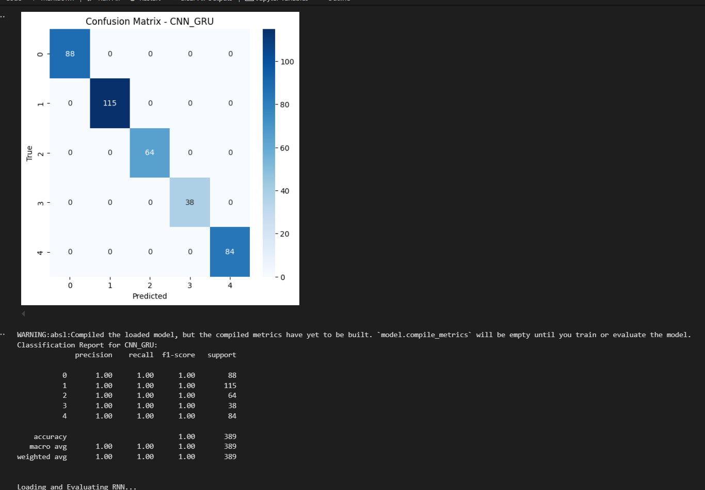
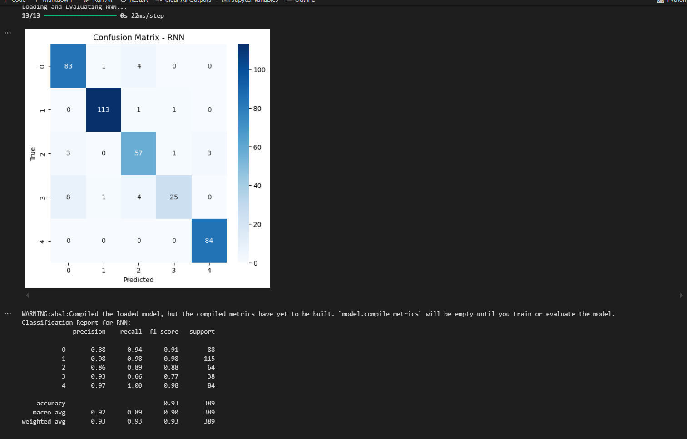
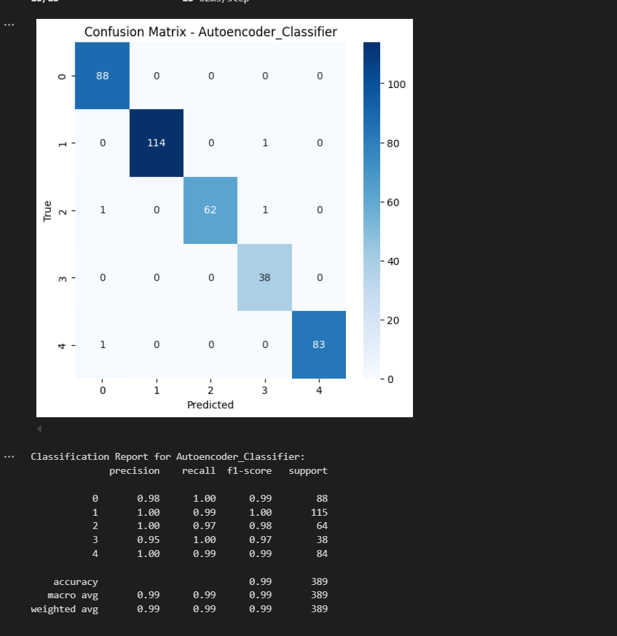
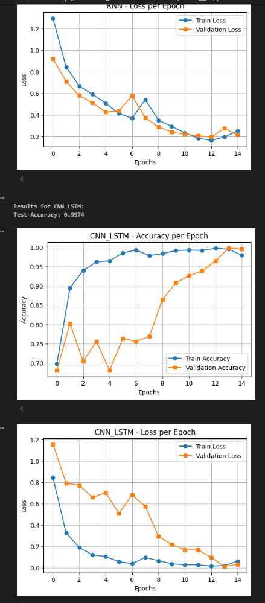

# GaitGuard
This project is a gait classification system that analyzes human walking patterns using video input. It utilizes Deep learning to classify gait types and provides a Flask-based web interface for easy video uploads and result visualization.

# Dataset & Preprocessing

* **Dataset Used:** Custom dataset (MP4 videos)
* **Preprocessing Steps:**
    * Extracted frames from videos.
    * Applied background subtraction and silhouette extraction.
    * Resized and normalized images for uniform input.
    * Augmented data to improve model generalization.

#  Model
* **Model Architecture:**
    * CNN_LSTM
    * CNN_GRU
    * RNN
    * Autoencoder_classifier

# System Workflow overview          
* **The gait classification system follows a structured pipeline to analyze human walking patterns and provide meaningful insights. The key steps are:**
    * Video Input
       * Accepts live or pre-recorded video footage.
    * Pose Estimation (MediaPipe)
       * Extracts 33 joint positions using the MediaPipe framework
    * Feature Extraction
       * Calculates key gait features such as:
          * Joint Angles
          * Stride Symmetry
          * Torso Tilt & Step Length
    * Preprocessing
       * Cleans and prepares extracted data for model training.
    * Gait Classification Models
       * Uses a combination of CNN-LSTM Model ,  CNN-GRU ModeL , Autoencoder Model ,RNN
    * Majority Voting Mechanism
       * Combines predictions from all models to improve classification accuracy.
    * Gait Classification
       * Determines type of abnomalities (slouch , limping , circumduction , no_arm_swing , normal)
    * Real-Time Visualization & Feedback
       * Displays classification results dynamically.
    * Medical Recommendations
       *Provides guidance such as Physiotherapy Suggestions and Posture Correction


# Installation & Usage
* **Installation:**
    * Clone the repository:
       ```bash
      git clone https://github.com/Sakshirai55555555555/GaitGuard.git
      cd gait-classification
       ```
    * Install the required dependencies:
        ```bash
        pip install -r requirements.txt
        ```
* **Usage:**
    ```bash
    python app.py
    ```
    * Open http://127.0.0.1:5000/ in the browser.
    * login / Signup
    * Upload a video file.
    * View result

# Results & Output
  * Sample output images
    
  * Confusion matrix
    
    
    
    
    
  * Accuracy/Loss plots
    
    
    
    

# Flask Web App
  * Users can upload gait videos through a simple web interface
  * The backend processes the video and classifies the gait type.
  * Results are displayed on the web app with visualizations.

    
